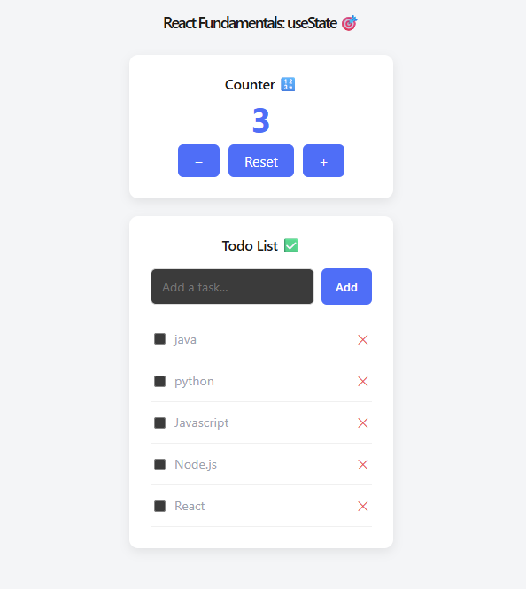
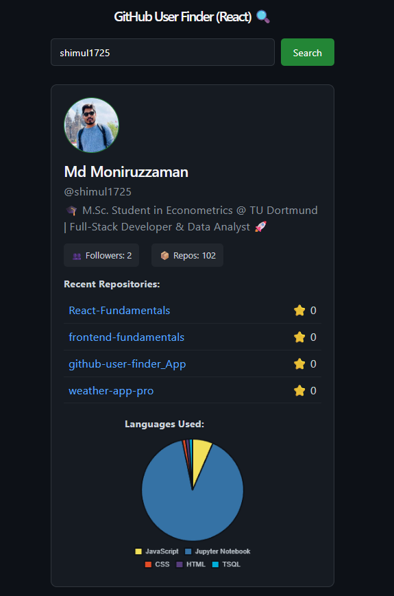
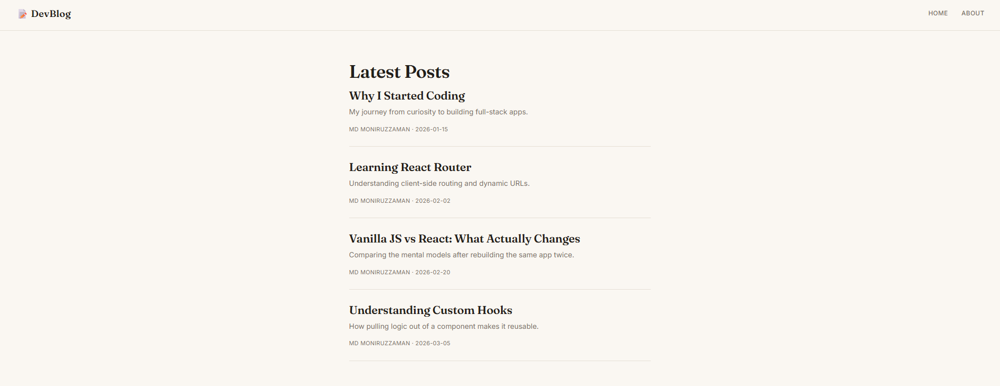
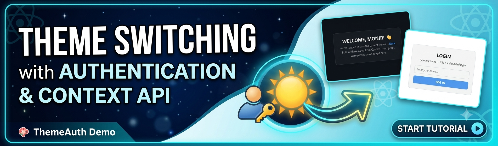

# React Fundamentals ⚛️

A collection of small React practice projects — building on the vanilla HTML/CSS/JS foundation from [Frontend Fundamentals](https://github.com/shimul1725/frontend-fundamentals), now learning component-based architecture, hooks, and state management.

Each folder is a self-contained project with its own `README.md`.

## 📁 Projects

<table>
  <tr>
    <th width="160">Preview</th>
    <th>Project</th>
    <th>Concepts Covered</th>
    <th>Status</th>
  </tr>
  <tr>
    <td></td>
    <td><a href="./react-counter-todo">01 · Counter + Todo</a></td>
    <td>useState, Component Composition, Controlled Inputs, Immutability</td>
    <td>✅ Done</td>
  </tr>
  <tr>
    <td></td>
    <td><a href="./github-finder-react">02 · GitHub User Finder (React)</a></td>
    <td>useEffect, Custom Hooks, Props, Third-party Libraries (Chart.js)</td>
    <td>✅ Done</td>
  </tr>
  <tr>
    <td></td>
    <td><a href="./blog-app-router">03 · Multi-page Blog App</a></td>
    <td>React Router, useParams, useNavigate</td>
    <td>✅ Done</td>
  </tr>
  <tr>
    <td></td>
    <td><a href="./theme-auth-context">04 · Theme + Auth Context App</a></td>
    <td>Context API, Global State</td>
    <td>✅ Done</td>
  </tr>
</table>

## 🎯 Why This Repo Exists

After building HTML/CSS/JS fundamentals in [Frontend Fundamentals](https://github.com/shimul1725/frontend-fundamentals), this repo is where I learn React properly — component thinking, hooks, and state management — before combining it with a Node.js backend in full MERN projects like [Bondhu](https://github.com/shimul1725/social-media) and my [portfolio site](https://github.com/shimul1725/my-profile-portfolio).

A recurring pattern here: rebuilding a project first made in vanilla JS (like the GitHub User Finder) in React, to directly compare the two mental models.

## 🛠️ Tech Used

- React 18
- Vite
- Vanilla CSS (no UI framework, to focus on fundamentals)

## 🚀 Running Any Project

```bash
git clone https://github.com/shimul1725/React-Fundamentals.git
cd React-Fundamentals/<project-folder>
npm install
npm run dev
```

Then open the local URL shown in the terminal (usually `http://localhost:5173`).

## 👤 Author

**Md Moniruzzaman**
- GitHub: [@shimul1725](https://github.com/shimul1725)
- Email: shimul.tu.dortmund@gmail.com